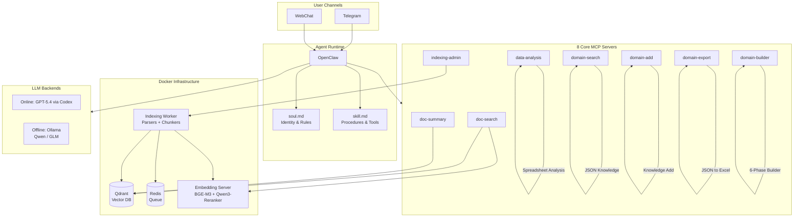

<p align="center">
  <h1 align="center">NEXUS</h1>
  <p align="center">
    <strong>Agentic RAG platform that builds domain-expert AIs from your documents</strong>
  </p>
  <p align="center">
    <a href="LICENSE"></a>
    
    
    
  </p>
</p>

---

---

## What is NEXUS?

NEXUS is an **Agentic RAG platform** that transforms your organization's documents and domain knowledge into a domain-expert AI.

**For non-technical users:** Upload your work process documents and domain knowledge spreadsheets, and NEXUS creates an AI expert that answers questions with sources and accuracy.

**For technical users:** A hybrid search (Dense+Sparse) + ONNX reranking + MCP-based tool orchestration platform with NFD (Nurture-First Development) architecture, where conversation experiences automatically crystallize into structured knowledge.

### How NEXUS Differs from Conventional RAG

| Aspect | Conventional RAG | NEXUS |
|--------|-----------------|-------|
| **Input** | Documents | Work processes + Domain data + Documents |
| **Output** | Search results | Domain-expert AI |
| **Behavior** | "Upload docs, get search results" | "Upload process + data, get an expert AI" |
| **Growth** | Manual re-indexing on doc updates | Auto-growth via conversations (experience becomes knowledge) |
| **Knowledge** | Static documents | Experience accumulation + automatic promotion |
| **Domain Scaling** | Code changes required | Just swap inputs via Domain Builder |

### Core Concept

```
Input:  process.md + domain_knowledge.xlsx + document folder
         ↓ (Domain Builder: 6-phase automatic pipeline)
Output: Domain-optimized AI expert
```

---

## Architecture

NEXUS is built on **Agentic RAG + MCP (Model Context Protocol) + Domain Skill plugin architecture**.



### MCP = LEGO Blocks, skill.md = Assembly Manual

MCP servers are **universal tools** (LEGO blocks), and skill.md defines **how to combine them** (assembly manual) for each domain.

| Domain Type | Same MCP Tools | Different skill.md |
|------------|---------------|-------------------|
| CS / Troubleshooting | doc-search, domain-search, domain-add | Intake -> Diagnose -> Root Cause -> Fix -> Verify -> Learn |
| Sales / Consulting | doc-search, domain-search, domain-add | Needs Analysis -> Proposal -> Negotiation -> Close -> Follow-up |
| R&D / Research | doc-search, domain-search, domain-add | Goal Setting -> Explore -> Validate -> Refine -> Report |

---

## NFD (Nurture-First Development) Architecture

Based on the paper [arxiv 2603.10808](https://arxiv.org/abs/2603.10808): *"Nurture-First Agent Development: Building Domain-Expert AI Agents Through Conversational Knowledge Crystallization"*

> **Core principle:** Domain-expert AI should be built through conversational knowledge crystallization during operation, not through pre-training.

```
Minimal Start  -->  Grow via Conversation  -->  Experience Becomes Knowledge
```

### Three-Layer Cognitive Architecture

```
┌─────────────────────────────────────────────────────────────┐
│  Layer 1: Constitutional (soul.md)                          │
│  ─────────────────────────────────────────────────────────  │
│  Identity, principles, behavior rules                       │
│  Volatility: LOW  (rarely changes)                          │
│  Loaded: Every session start                                │
│  Changed by: Domain Builder or admin                        │
├─────────────────────────────────────────────────────────────┤
│  Layer 2: Skill (skill.md + structured knowledge)           │
│  ─────────────────────────────────────────────────────────  │
│  Procedures, response guides, MCP tool mapping              │
│  Volatility: MEDIUM  (updated via Crystallization)          │
│  Loaded: On relevant task request                           │
│  Changed by: Auto-promotion or admin                        │
├─────────────────────────────────────────────────────────────┤
│  Layer 3: Experiential (JSON + conversation logs)           │
│  ─────────────────────────────────────────────────────────  │
│  Daily accumulated experience data                          │
│  Volatility: HIGH  (real-time accumulation)                 │
│  Layer 3-A: logs/YYYY-MM-DD.jsonl  (raw logs)              │
│  Layer 3-B: domain_knowledge.json  (structured knowledge)   │
└─────────────────────────────────────────────────────────────┘
```

---

## Knowledge Crystallization Cycle

Knowledge flows from raw conversation to structured, validated, and promoted knowledge:


### Promotion Criteria (Layer 3 -> Layer 2)

All conditions must be met:

| Condition | Threshold |
|-----------|-----------|
| Usage count | `usage_stats.suggested >= 5` |
| Success rate | `usage_stats.success_rate >= 0.80` |
| No conflict | No contradiction with existing skill.md |

### Crystallization Schedule

| Frequency | Task | Mode |
|-----------|------|------|
| **Real-time** | Log saving, field extraction, usage_stats update | Automatic |
| **Weekly** | Promotion check -> skill.md update + report | Automatic |
| **Monthly** | JSON -> Excel export (offline review) | Automatic |

---

## Domain Builder -- 6 Phases

The Domain Builder transforms raw inputs into a fully operational domain-expert AI through 6 automated phases.

```
Phase 1          Phase 2          Phase 3
process.md  -->  Excel Analysis   skill.md
Refinement       JSON Conversion  Auto-generation
    |                |                |
    v                v                v
Phase 4          Phase 5          Phase 6
soul.md     -->  config.yaml -->  Document
Refinement       Auto-generation  Indexing
    |                |                |
    v                v                v
              Domain Complete!
```

### Phase Details

| Phase | Name | Description |
|-------|------|-------------|
| **1** | process.md Refinement | Socratic questioning guided by selected framework. LLM selects from 7 frameworks, then conducts conversational consulting to refine the process definition. |
| **2** | Excel -> JSON Conversion | Automatic structure inference from domain_knowledge.xlsx. Each row becomes a JSON object with auto-generated metadata (id, source, created_at, usage_stats). |
| **3** | skill.md Generation | LLM writes the skill file using **SCAR principles** + **framework-specific process structure guide**. Not template-filling -- free-form generation guided by principles. |
| **4** | soul.md Generation | Conversational Q&A with the user to define agent identity, rules, tone, and safety guidelines. |
| **5** | config.yaml Generation | Auto-generated domain configuration (paths, workspace, crystallization settings). |
| **6** | Document Indexing | Triggers the indexing pipeline for the domain's document folder. |

---

## SCAR Principles (skill.md Writing Guide)

SCAR is a set of **writing principles**, not a rigid template. It guides how the LLM generates skill.md files.

| Principle | Origin | Purpose |
|-----------|--------|---------|
| **S** -- SOP | SOP-Agent + Grab SOP | Write step-by-step imperative commands, not prose |
| **C** -- Constraint Language | AWS Strands SOP (RFC 2119) | Use **MUST** / **SHOULD** / **MAY** keywords to specify constraint levels |
| **A** -- Agent Skill Principles | Block 3 Principles | Separate **deterministic** (tool calls, data formats) from **non-deterministic** (reasoning, tone) |
| **R** -- Runbook Style | SRE Runbook | Write for a tired 3am on-call engineer -- concise checklists, not marketing copy |

### skill.md Universal Skeleton

```markdown
# {Domain Display Name} Skill

## Role
[One-sentence role definition -- who is served, what is done]

## Tools
[Available MCP tools -- one-line description each]

## Process
[Framework-specific structure -- varies by domain type]

## Knowledge Extraction Fields
[Fields to extract from conversations into domain_knowledge.json]

## Result Criteria
[How to determine if a task unit is resolved]

## Rules
[Constraints using MUST / SHOULD / MAY keywords]

## On Completion
[Post-task actions -- log saving, knowledge extraction]
```

---

## Framework Catalog (7 Frameworks)

The Domain Builder selects the optimal framework based on process characteristics during Phase 1.

| ID | Framework | Process Type | Methodology Basis | Example Domains |
|----|-----------|-------------|-------------------|-----------------|
| **A** | Diagnostic-Branching | Condition -> Branch tree | Decision Tree + IDEF0 + 5 Whys | CS/AS, equipment maintenance, IT helpdesk |
| **B** | Exploration-Discovery | Search -> Hypothesize -> Validate | OODA Loop + Design Thinking + MECE | R&D, market research, patent search |
| **C** | Sequential-Procedural | Step 1 -> Step 2 -> ... -> Done | SIPOC + VSM + BPMN | Manufacturing, onboarding, accounting |
| **D** | Relational-Persuasive | Understand -> Propose -> Negotiate | JTBD + RACI + Cynefin | B2B sales, contract negotiation, CRM |
| **E** | Analytical-Decision | Collect -> Analyze -> Evaluate -> Decide | DMAIC + MECE + Decision Matrix | Financial analysis, strategy, risk assessment |
| **F** | Creative-Design | Ideate -> Prototype -> Validate (iterate) | Design Thinking + PDCA + Cynefin | Product design, UX, campaign planning |
| **G** | Monitor-Respond | Watch -> Alert -> Act (event-driven) | OODA Loop + IDEF0 + PDCA | System ops, security monitoring, inventory |

Each framework provides:
- **Phase 1:** Question directions for process refinement consulting
- **Phase 3:** Process structure guide for skill.md generation
- **Search pattern guide:** Domain-optimized retrieval strategies

---

## RAG Quality Improvement Tiers

All improvements happen at the **engine level** -- every domain benefits automatically. No additional GPU required.

| Tier | Name | Core Question | Technique |
|------|------|--------------|-----------|
| **0** | Input Quality (Parsing) | Did we read the document correctly? | Docling + PaddleOCR for scanned PDFs, LLM structure inference for broken Excel |
| **1** | Processing Quality (Chunking) | Did we process the text well? | Parent-Child Chunking + Contextual Chunking |
| **2** | Search Quality | Did we find the right results? | HyDE (Agent-driven query transformation) + Reranker |
| **3** | Advanced (Future) | Do we understand more deeply? | GraphRAG, ColPali (reserved) |

### Parent-Child Chunking

```
┌──────────────────────────────────────────────┐
│  Parent Chunk (2048 tokens)                  │  <-- Returned as search result
│  ┌──────────┐ ┌──────────┐ ┌──────────┐     │      (preserves context)
│  │  Child 1  │ │  Child 2  │ │  Child 3  │   │  <-- Used for vector matching
│  │ 384 tok   │ │ 384 tok   │ │ 384 tok   │   │      (search precision)
│  └──────────┘ └──────────┘ └──────────┘     │
└──────────────────────────────────────────────┘

Search on Child  -->  Return Parent  -->  Rich context for LLM
```

### Contextual Chunking

Before embedding, an LLM generates a **one-sentence context** for each chunk:

```
[LLM-generated context] + [Original chunk text]  -->  Embedding
```

- Improves keyword matching without extra search-time cost
- Context is embedded together with the original text
- No runtime overhead -- cost is paid once at indexing time

---

## Domain Lifecycle Management

| Command | Description |
|---------|-------------|
| `switch_domain` | Switch between domain mode and Core (builder) mode |
| `backup_domain` | Backup domain files + Qdrant snapshot |
| `reset_to_core` | Reset to builder mode (clears Qdrant/Redis) |

---

## Quick Start

### Prerequisites

- Docker & Docker Compose
- Python 3.11+
- ~2GB disk space for models (BGE-M3 + Qwen3-Reranker ONNX)

### Setup

```bash
# 1. Clone the repository
git clone https://github.com/aihwangso/NEXUS.git
cd NEXUS/nexus

# 2. Configure environment variables
cp .env.example .env
# Edit .env: set DOCS_PATH, DOMAINS_BASE, QDRANT_API_KEY, OPENAI_API_KEY

# 3. Download ONNX models
bash scripts/download_models.sh
# Downloads BGE-M3 (~1.1GB) and Qwen3-Reranker-0.6B (~600MB) to models/

# 4. Start Docker infrastructure
docker compose up -d
# Starts: Qdrant (6333), Redis (6379), Embedding server (8080), Indexing worker

# 5. Initialize Qdrant collection
bash scripts/init_qdrant.sh

# 6. Install and configure OpenClaw agent runtime
# See: https://github.com/openclaw/openclaw
# Configure MCP bridge to connect to NEXUS MCP servers

# 7. Prepare domain input
mkdir -p ../domains/my-domain
# Place: process.md (work process draft) + domain_knowledge.xlsx (domain data)
# Point DOCS_PATH to your document folder

# 8. Build your domain expert
# In chat: "Build domain skill for my-domain"
# Domain Builder runs Phase 1~6 automatically
```

### Port Mapping

| Service | Port | Runtime |
|---------|------|---------|
| Qdrant | 6333 | Docker |
| Redis | 6379 | Docker |
| Embedding Server | 8080 | Docker |
| Ollama (offline LLM) | 11434 | Native |
| OpenClaw Gateway | 18789 | Native |
| WebChat | 3000 | Native |

---

## Directory Structure

```
NEXUS/
├── nexus/                          # Core engine
│   ├── core/
│   │   └── domain-builder/         # 6-phase builder engine
│   │       ├── process_refiner.py  #   Phase 1: process.md refinement
│   │       ├── converter.py        #   Phase 2: Excel -> JSON conversion
│   │       ├── skill_generator.py  #   Phase 3: skill.md generation
│   │       ├── soul_generator.py   #   Phase 4: soul.md generation
│   │       ├── config_generator.py #   Phase 5: config.yaml generation
│   │       ├── scar_guide.md       #   SCAR writing principles reference
│   │       └── frameworks.md       #   7 framework catalog reference
│   ├── services/
│   │   ├── embedding/              # BGE-M3 + Qwen3-Reranker (ONNX, FastAPI)
│   │   ├── indexing/               # Document processing pipeline
│   │   │   ├── parsers/            #   PDF, Excel, DOCX, PPTX, CSV, TXT
│   │   │   ├── chunkers/          #   Semantic + Parent-Child chunking
│   │   │   ├── worker.py          #   Indexing worker (parse->chunk->embed->store)
│   │   │   └── watchdog_service.py #   Filesystem change detection -> Redis queue
│   │   └── mcp-servers/            # 8 MCP tool servers
│   │       ├── doc-search/         #   Hybrid document search (7-stage pipeline)
│   │       ├── doc-summary/        #   Document summarization
│   │       ├── data-analysis/      #   Spreadsheet analysis (sum/avg/filter/compare)
│   │       ├── indexing-admin/     #   Indexing management
│   │       ├── domain-search/     #   JSON knowledge search
│   │       ├── domain-add/        #   JSON knowledge addition + logging
│   │       ├── domain-export/     #   JSON -> Excel export
│   │       └── domain-builder/    #   Domain Builder orchestration
│   ├── config/
│   │   └── openclaw/               # Agent runtime configuration
│   ├── scripts/                    # Setup and maintenance scripts
│   ├── models/                     # ONNX models (git-ignored, ~2GB)
│   ├── docker-compose.yml          # Docker orchestration
│   └── nexus.config.yaml           # System configuration
├── domains/                        # Built domains (runtime output, git-ignored)
│   └── {domain-name}/
│       ├── process.md              #   Work process (input + Phase 1 refined)
│       ├── domain_knowledge.xlsx   #   Domain knowledge Excel (input)
│       ├── skill.md                #   AI behavior guide (generated)
│       ├── soul.md                 #   AI identity/rules (generated)
│       ├── config.yaml             #   Domain config (generated)
│       ├── domain_knowledge.json   #   Structured knowledge (generated + grows)
│       ├── logs/                   #   Conversation logs (runtime)
│       └── exports/                #   Excel exports (runtime)
├── examples/                       # Templates for domain building
├── docs/                           # Documentation
├── LICENSE                         # MIT License
└── CONTRIBUTING.md                 # Contribution guidelines
```

---

## Tech Stack

| Category | Technology | Purpose |
|----------|-----------|---------|
| Embedding | BGE-M3 (ONNX) | Text -> Dense (1024d) + Sparse vectors |
| Reranker | Qwen3-Reranker-0.6B (ONNX) | Search result reranking (yes/no logits + softmax) |
| Vector DB | Qdrant | Hybrid vector storage & search (Dense + Sparse) |
| Queue | Redis 7 Alpine | Indexing job queue with retry & dead-letter |
| Document Parsing | Docling + PyMuPDF + PaddleOCR | PDF, DOCX, PPTX, HTML parsing + OCR |
| Spreadsheet Parsing | openpyxl | XLSX, XLS, CSV analysis |
| Chunking | tiktoken (cl100k_base) | Token-based semantic + Parent-Child chunking |
| Agent Runtime | OpenClaw | MCP-native agent with Telegram + WebChat |
| MCP SDK | mcp\[cli\] 1.9.2 | Model Context Protocol server framework |
| Online LLM | GPT-5.4 via Codex | Primary reasoning engine |
| Offline LLM | Ollama (Qwen, GLM) | Local / confidential processing |
| Embedding Server | FastAPI + ONNX Runtime | CPU-optimized inference (/embed, /rerank, /health) |
| Container | Docker Compose | Infrastructure orchestration |

---

## Search Pipeline (7 Stages)

```
Stage 1: Query Embedding          BGE-M3 -> dense (1024d) + sparse vectors
    ↓
Stage 2: RBAC Filter              Workspace-based access control
    ↓
Stage 3: Dense Vector Search      Cosine similarity, top-20 candidates
    ↓
Stage 4: Sparse Vector Search     IDF modifier, top-20 candidates
    ↓
Stage 5: RRF Score Fusion         Dense weight 0.7 + Sparse weight 0.3, k=60
    ↓
Stage 6: Qwen3 Reranking          yes/no logits -> softmax -> score, top-10
    ↓
Stage 7: Result Formatting        Source (file, page) + text + score
```

---

## License

[MIT License](LICENSE) -- Copyright (c) 2026 Blackshim

---
